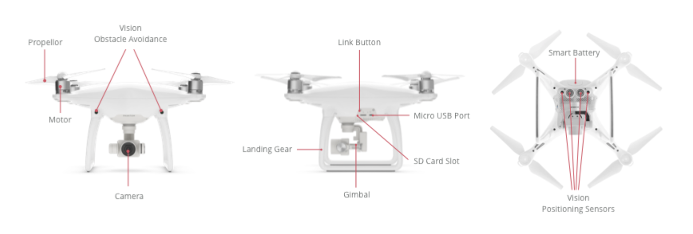

## 하드웨어 소개 

DJI 제품들은 소형이고 고성능의 기능과 원격제어가 가능한 비행체아며 일반 소비자뿐아니라 상업용 어플리케이션에 적합한 휴대용카메라(hand held cameras)와 안정기(stabilizers)를 생산한다. 이 제품들은 사용하기 쉽고 저렴하며 업계 최고의 품질과 기능을 갖추고 있다. 

### 비행체

DJI는 Mavic Air, Mavic Pro, Phantom 시리즈, Inspire 시리즈, Matrice 200 시리즈, Matrice 100 and Matrice 600을 포함한 모바일 SDK로 자동화 할수 있는 다양한 멀티로터(multi-rotor)비행체를 보유하고 있다. 

DJI 비행체의 주요 특징 중 하나는 비행방식에 상관없이 카메라가 수평을 유지 할 수 있다는 것이다. 그 카메라는 짐벌(gimbal)이 장착되어 있는데 이 짐벌은 비행체가 어떤 회전을 해도  선명하고 아름다운 이미지와 비디오를 산출해 낼수있도록 비행체의 회전을 보완해준다.

다양한 특징, 성능 크기 및 가격을 제공하는 DJI 비행체가 많이 있다. 구체적인 측정을 요구하는 개발자나 일반 소비자들은 비행체를 선택할 때 다음 사항들을 확인해야 한다 : 

- 비행시간
- 크기 및 무게
- 카메라 사양 (화질 및 동작)
- 교체가능 카메라
- 장애물 회피
- 사용자지정 탑재체(payload)
- 최대 상승 한도
- 사용 가능 액세서리
- 원격조종 기능
- 가격 

### 핸드헬드 카메라(Handheld Camera)

DJI의 핸드헬드 카메라인 Osmo시리즈는 DJI의 비행체 카메라 안정화 짐벌 기술을 휴대하기 쉬운 핸들에 통합하여 사용자가 움직일때 자연스럽고 전문적인 비디오를 찍는 것이 가능하게 해준다.

 ### 독립형 컴포넌트

배행체의 두개의 컴포넌트(비행 컨트롤러, 무선링크)는 DJI 및 타사의 비행체에서 사용할 수 있다. 이러한 컴포넌트들은 중 일부는 DJI 모바일 SDK에서 제한적으로 지원된다. 

### 액세서리 

DJI 비행체와 핸드헬드 카메라는 다양한 DJI액세서와 호환된다. 이러한 액세서리들 중 일부는 DJI모바일 SDK에서도 지원된다. 즉, 모바일장치가 액세서리와 어느정도 상호작용이 가능함을 의미한다.

### 컴포넌트 

상세한 제품비교를 하기전에 제품의 구성요소와 기능을 이해하면 유용하다.

모든 제품은 중요한 특징 혹은 기능을 제공하는 컴포넌트 모듈로 구성되어있다. 일반적인 구성요소에 대한 소개는 Component Cuide에서 자세히 설명한다.

### 추진력